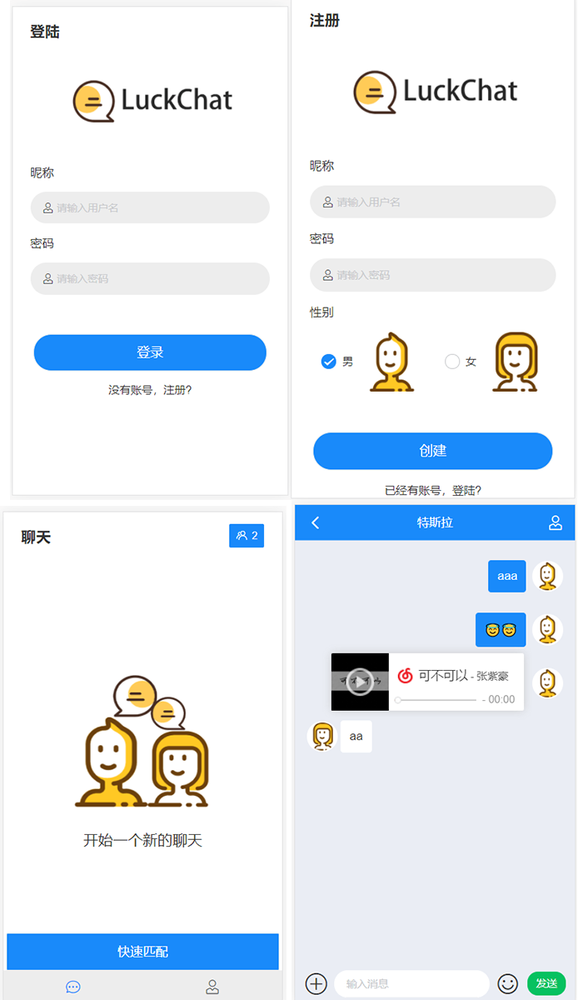

<center><h1>LuckChat</h1></center>

---

     [](./LICENSE)

> `LuckChat` 是一个随机匿名聊天软件， 仅供学习和课设使用。如果对你有用，请给一个小小的 star。

## 功能简介

### 已经完成

- [x] 登陆/注册/注销
- [x] 查看在线人数
- [x] 随机匹配两个人
- [x] 文字聊天
- [x] 表情包

### 待开发

- [ ] 发送图片/视频/音频
- [ ] 更换头像
- [ ] 聊天机器人
- [ ] 保存聊天数据
- [ ] 群组

## 预览




## 模块介绍

| 模块       | 作用          |
| ---------- | ------------- |
| chat-vue   | 客户端部分    |
| chat-admin | 后端          |
| sql        | 数据库sql文件 |
| imgs       | 预览的图片    |
| README.md  | 项目文档      |

## 技术栈

* Springboot 
* Mybatis-plus
* SpringBoot WebSocket
* Vue/Vuex/Vue-router
* Vant
* MySQL


## 使用方法

需要同时运行前端和后端。

### chat-vue 前端

#### 开发

1. 克隆整个工程

   * 需要安装`git `工具 [(点击下载)](https://git-scm.com/downloads)

   * `GitHub`也支持直接下载  zip 压缩包, 直接解压即可

   * 克隆命令 

     ```bash
     git clone 
     ```

2. 打开一个终端或者 `cmd`, 使用 `cd` 命令进入 `chat-vue` 目录下

3. 安装 node 依赖 

   * 需要先下载安装 `node.js`  [(点击下载)](https://nodejs.org/zh-cn/)
   * 配置`node.js`软件源 [教程](https://zmblog.wang/article/nodejschedihuanyuan)
   * 执行命令
   
   ```bash
   npm install
   ```
   
4. 运行

   ```bash
   npm run serve
   ```

5. 编译

   ```bash
   npm run build
   ```

   生成的代码位于 `dist`文件夹下

#### 打包为APK

* [文档](https://zmblog.wang/article/vue-dabaowei-APK)


### chat-admin 后端

1. 导入 IDEA 即可运行，
2. `application-dev.yml`配置数据库地址，用户名，密码。
3. 在自己的数据库里创建一个 `chat`数据库， 执行 `sql` 文件夹里的`sql`脚步。 
4. 需要配置`maven`环境， 项目需要`maven`去配置依赖


## 开源协议

 [](./LICENSE)


## 赞助

> 如果对你有用，欢迎赞助

